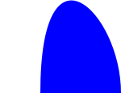
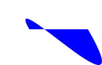

## Documentation

```
;;; (filled-curve source source-angle source-pull target target-angle target-pull color [description])
;;;   source : pt?
;;;   source-angle : real?
;;;   source-pull : real?
;;;   target : pt?
;;;   target-angle : real?
;;;   target-pull : real?
;;;   color : color?
;;;   description : string?
;;; Create a "filled" curve from `source` to `target`. The curve 
;;; leaves `source` at the specified angle and enters `target` from 
;;; the specified angle. The filled area is between the curve and
;;; the straight line between `source` and `target`.
;;;
;;; (In both cases, 0 degrees is right, 90 degrees is up, 180 degrees
;;; is left, and 270 degrees is down.) The `pull` parameters indicate
;;; the inclination to curve in that direction; more pull means it
;;; travels further.
```

## Examples

```
> (filled-curve (pt 50 50) 90 1 (pt 150 50) 90 1 "blue")

.
> (filled-curve (pt 50 50) 90 2 (pt 150 50) 90 1 "blue")

.
> (filled-curve (pt 50 50) 120 1 (pt 150 50) -60 1 "blue")

.
> (filled-curve (pt 50 50) 120 1 (pt 150 50) -60 2 "blue")

```

## See also

[`curve`](../procs/curve).

## Questions

_Forthcoming_
