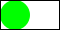

## Documentation

```
;;; (frame img) -> image?
;;;   img : image?
;;; Add a frame around the image (generally for debugging).
```

## Examples

```
> (frame (solid-circle 30 "blue"))

> (frame (outlined-square 30 "red" 10))

> (solid-square 30 transparent)

> (frame (solid-square 30 transparent))

> (frame (beside (solid-square 30 transparent) (solid-circle 30 "purple")))

> (frame (beside (solid-circle 30 "green") (solid-square 30 transparent)))

> (frame (frame (frame (solid-square 30 transparent))))

```

## Sample implementation (_advanced_)

```
```

## Tests

_Forthcoming_

## See also

_Forthcoming_

## Questions

_Forthcoming_
