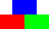
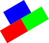
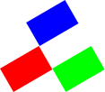
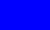

## Documentation

```
;;; (image-map fun img) -> image?
;;;   fun : (image? -> image?)
;;;   img : image?
;;; Apply a function to each basic image in an image.
```

## Examples

```
> (define stuff
    (above (solid-rectangle 50 30 "blue")
           (beside (solid-rectangle 50 30 "red")
                   (solid-rectangle 50 30 "green"))
           "an arrangement of three rectangles"))
> stuff

> (define rotate30
    (lambda (img)
      (rotate img 30)))
> (rotate30 stuff)

> (image-map rotate30 stuff)

> (define to-ellipse
    (lambda (img)
      (solid-ellipse (image-width img) (image-height img) (image-color img))))
> (solid-rectangle 50 30 "blue")

> (to-ellipse (solid-rectangle 50 30 "blue"))

> (rotate30 (to-ellipse (solid-rectangle 50 30 "blue")))

> (image-map to-ellipse stuff)

> (image-map rotate30 (image-map to-ellipse stuff))

```

## Tests

_Forthcoming_

## See also

_Forthcoming_

## Questions

_Forthcoming_
