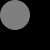

## Documentation

```
;;; (image-subtract img1 img2 [description]) -> image?
;;;   img1 : image?
;;;   img2 : image?
;;;   description : string?
;;; "Subtract" `img2` from `img1`, decreasing the opacity of each
;;; pixel in `img1` by the opacity of the corresponding pixel in
;;; `img2`. `image-subtract` does not otherwise affect the colors
;;; in `img1`.
```

## Examples

```
> (image-subtract (solid-square 50 "black") (solid-square 30 "red"))

> (image-subtract (solid-square 50 "red") (solid-circle 30 "blue"))

> (image-subtract (solid-circle 50 "blue") (solid-square 30 "white"))

> (image-subtract (solid-square 50 "green") (solid-circle 60 "yellow"))

> (image-subtract (solid-square 50 "black") (solid-circle 30 (rgb 0 0 0 128)))

```

## Tests

_Forthcoming_

## See also

[bitmap](../procs/bitmap)

## Questions

_Forthcoming_
