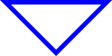
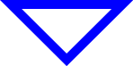
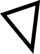

## Documentation

```
;;; (outlined-polygon points color pen-width [description]) -> image?
;;;   points : (list-of point?)
;;;   color : color?
;;;   line-width : positive-integer?
;;;   description : string?
;;; Create a polygon whose vertices are given by `points` and which
;;; is outlined by a `color` line whose width is given by `line-width`.
;;;
;;; Note: Although the points in the polygon may not describe a shape
;;; whose left edge is 0 and whose top edge is 0, `outlined-polygon` will
;;; shift the polygon so that the left is 0 and the top is 0. 
;;;
;;; Warning! The edges of the polygon should not cross. In such cases,
;;; the results are unpredictable.
;;;
;;; Warning! Due to some infelicities in the design of `outlined-polygon`,
;;; it does not always work correctly for non-convex polygons
```

## Examples

```
> (outlined-polygon (list (pt 0 0) (pt 100 0) (pt 50 50)) "blue" 5)

> (outlined-polygon (list (pt 0 0) (pt 100 0) (pt 50 50)) "blue" 10)

> (outlined-polygon (list (pt 100 10) (pt 200 20) (pt 80 40)) "red" 1)

> (outlined-polygon (list (pt -20 -30) (pt 40 -50) (pt 30 30)) "black" 8)

> (outlined-polygon (list (pt 0 0) (pt 100 0) (pt 50 25)
                     (pt 100 50) (pt 0 50))
                  "purple"
                  5)

```

## Tests

_Forthcoming_

## See also

[`polygon?`](../procs/polygon-p),
[`solid-polygon`](../procs/outlined-polygon)

## Questions

_Forthcoming_
