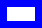

## Documentation

```
;;; (outlined-rectangle width height color line-width [description]) -> image?
;;;   width : nonnegative-real?
;;;   height : nonnegative-real?
;;;   color : color?
;;;   line-width : positive-integer?
;;;   description : string?
;;; A rectangle of the specified width and height, outlined with a
;;; line of the specified color and width.
```

## Examples

```
> (outlined-rectangle 40 20 "blue" 5)

> (outlined-rectangle 40 20 "blue" 10)

> (outlined-rectangle 10 40 "blue" 1)

```

## Sample implementation (_intermediate_)

```
(define outlined-rectangle
  (lambda (width height color line-width)
    (outlined-polygon (list (pt 0 0) 
                            (pt width 0) 
                            (pt width height)
                            (pt 0 height))
                      color
                      line-width)))
```

## Tests

_Forthcoming_

## See also

[`outlined-polygon`](../procs/outlined-polygon)
[`solid-rectangle`](../procs/solid-rectangle)

## Questions

_Forthcoming_
