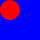

## Documentation

```
;;; (overlay/align halignment valignment i1 i2 ... in [description]) -> image?
;;;   halignment : horizontal-alignment?
;;;   valignment : vertical-alignment?
;;;   i1 : image?
;;;   i2 : image?
;;;   ...
;;;   in : image?
;;; Overlay the two images, aligning them as described.
;;;
;;; halignment is either "left", "center", or "right".
;;; valignment is either "top", "center", or "bottom".
```

## Examples

```drracket
> (overlay/align "left" "top" (solid-circle 20 "red") (solid-square 40 "blue"))

> (overlay/align "center" "top" (solid-circle 20 "red") (solid-square 40 "blue"))

> (overlay/align "right" "top" (solid-circle 20 "red") (solid-square 40 "blue"))

> (overlay/align "left" "center" (solid-circle 20 "red") (solid-square 40 "blue"))

> (overlay/align "center" "center" (solid-circle 20 "red") (solid-square 40 "blue"))

> (overlay/align "right" "center" (solid-circle 20 "red") (solid-square 40 "blue"))

> (overlay/align "left" "bottom" (solid-circle 20 "red") (solid-square 40 "blue"))

> (overlay/align "center" "bottom" (solid-circle 20 "red") (solid-square 40 "blue"))

> (overlay/align "right" "bottom" (solid-circle 20 "red") (solid-square 40 "blue"))

```

## Tests

_Forthcoming_

## See also

[`overlay`](../procs/overlay),
[`overlay/origin`](../procs/overlay-origin)

## Questions

_Forthcoming_
