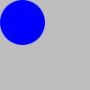
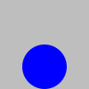
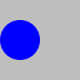

## Documentation

```
;;; (place img xside x yside y bg) -> image?
;;;   img : image?
;;;   xside : (one-of "left" "center" "right")
;;;   x : real?
;;;   yside : (one-of "top" "center" "bottom")
;;;   y : real?
;;;   bg : image?
;;;   description : string?
;;; Place `img` on `bg`, with the `xside` of `img` at `x` and the
;;; `yside` of `img` at `y`. Crop the result at the edges of `bg`.
```

## Examples

```
> (define canvas (solid-square 100 "gray"))
> (define circ (solid-circle 50 "blue"))
> (place circ "center" 0 "center" 0 canvas)

> (place circ "left" 0 "top" 0 canvas)

> (place circ "center" 50 "bottom" 100 canvas)

> (place circ "right" 50 "center" 50 canvas)

```

## Tests

_Forthcoming_

## See also

_Forthcoming_

## Questions

_Forthcoming_
