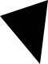

## Documentation

```
;;; (solid-polygon points color [description]) -> image?
;;;   points : (list-of point?)
;;;   color : color?
;;;   description : string?
;;; Create a polygon whose vertices are given by `points` and whose
;;; color is `color`.
;;;
;;; Note: Although the points in the polygon may not describe a shape
;;; whose left edge is 0 and whose top edge is 0, `solid-polygon` will
;;; shift the polygon so that the left is 0 and the top is 0. 
;;;
;;; Warning! The edges of the polygon should not cross. In such cases,
;;; the results are unpredictable.
```

## Examples

```
> (solid-polygon (list (pt 0 0) (pt 100 0) (pt 50 50)) "blue")

> (solid-polygon (list (pt 100 10) (pt 200 20) (pt 80 40)) "red")

> (solid-polygon (list (pt -20 -30) (pt 40 -50) (pt 30 30)) "black")

> (solid-polygon (list (pt 0 0) (pt 100 0) (pt 50 25)
                     (pt 100 50) (pt 0 50))
               "purple")

```

## Tests

_Forthcoming_

## See also

[`outlined-polygon`](../procs/outlined-polygon),
[`polygon?`](../procs/polygon-p)

## Questions

_Forthcoming_
