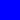

## Documentation

```
;;; (square side mode color) -> image?
;;;   side : non-negative-real?
;;;   mode : mode?
;;;   color : color?
;;; Creates a square with the given side-length, mode, and color.
;;;
;;; Note that this procedure has been deprecated in CSC-151 in favor
;;; of `solid-square` and `outlined-square`.
```

## Examples

```
> (square 20 "solid" "blue")

> (square 40 "solid" "blue")

```

## See also

[mode?](mode-p), 
[outlined-square](outlined-square),
[solid-square](solid-square)
